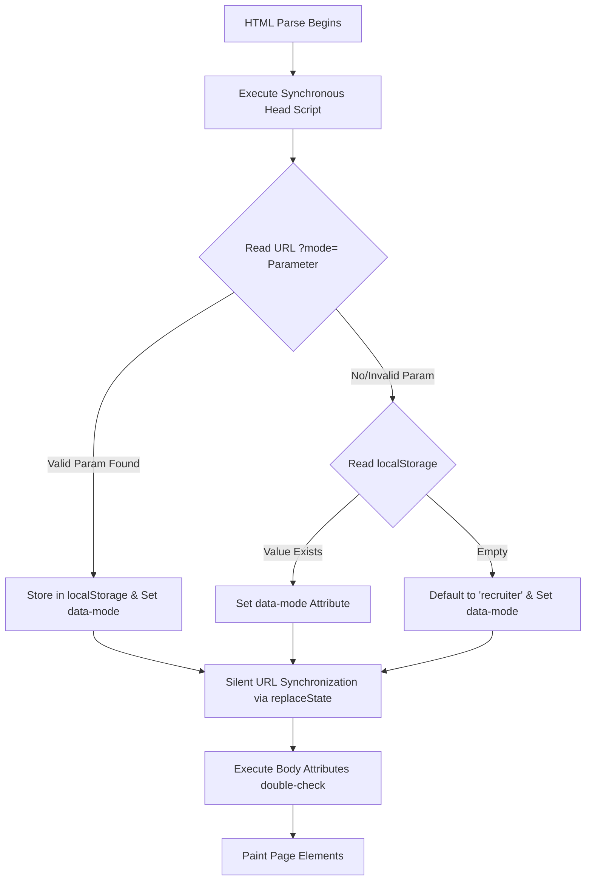

# Mohammad Zaki Jariwala — Interactive Portfolio Design System Spec

This document serves as the absolute, single source of truth for the visual architecture, design tokens, component specifications, and behavioral interactions of the **Mohammad Zaki Jariwala Interactive Resume Portfolio**. It defines the engineering and design rules used to implement this multi-perspective web application, serving as a spec sheet for developer tools, stitching frameworks, and design verification.

---

## 1. Core Visual Architecture & Philosophy

The application is an **agent-native, multi-perspective portfolio** constructed on the principle of progressive disclosure. Instead of forcing a single narrative, it tailrows content and styles to three distinct audiences:

1. **Recruiter Mode (Default):** High-level accomplishments, key SRE/Ops/DB metrics, and verified certifications. Employs a professional, high-trust **Cobalt Blue** accent.
2. **Developer Mode:** Comprehensive technical details, repository links, learning tracks, and interactive visual features. Employs a technical, terminal-inspired **Emerald Green** accent.
3. **Curious Mode:** An editorial, narrative-driven experience ("Why I Built It" blocks) illustrating architectural decisions and zero-cost hosting setups. Employs an organic, creative **Ochre Yellow** accent.

---

## 2. Color Palette & Semantic Tokens

The design system implements a dynamic, semantic token structure mapping to CSS Custom Properties. The active accent color dynamically updates across all elements when the user shifts perspectives.

### 2.1 CSS Custom Properties (Theme-Invariant & Dynamic)

```css
:root {
  /* Surface & Base Layout */
  --background: #F8F7F4;
  --surface: #FFFFFF;
  --border: rgba(0, 0, 0, 0.08);
  --text-primary: #1A1A1A;
  --text-secondary: #6B6B6B;
  
  /* Mode-Specific Accents (Base Colors) */
  --accent-recruiter: #1A6BFF;
  --accent-developer: #1A8A5A;
  --accent-curious: #B87A00;

  /* Mode-Specific Accents (Muted/Background States) */
  --accent-muted-recruiter: #E8F0FF;
  --accent-muted-developer: #E8F8F0;
  --accent-muted-curious: #FFF8E8;

  /* Status Badges */
  --badge-completed: #D1FAE5;
  --badge-completed-text: #065F46;
  --badge-progress: #FEF3C7;
  --badge-progress-text: #92400E;

  /* Default Active Active Mappings */
  --accent: var(--accent-recruiter);
  --accent-muted: var(--accent-muted-recruiter);
}
```

### 2.2 Dark Mode Overrides (`[data-theme="dark"]`)

Dark mode values optimize readability and sustain visual balance through softened surfaces and adjusted opacity scales.

```css
[data-theme="dark"] {
  /* Surface & Base Layout */
  --background: #111111;
  --surface: #1C1C1C;
  --border: rgba(255, 255, 255, 0.08);
  --text-primary: #F0F0F0;
  --text-secondary: #888888;

  /* Mode-Specific Accents (Muted/Background States) */
  --accent-muted-recruiter: #1A2640;
  --accent-muted-developer: #133020;
  --accent-muted-curious: #3a2a10;

  /* Status Badges (Dark Mode Harmonization) */
  --badge-completed: #064E3B;
  --badge-completed-text: #A7F3D0;
  --badge-progress: #78350F;
  --badge-progress-text: #FDE68A;
}
```

### 2.3 Perspective Colors Summary

| Mode | Accent HEX (Light) | Accent HEX (Dark) | Accent Muted (Light) | Accent Muted (Dark) | Focus Accent |
| :--- | :--- | :--- | :--- | :--- | :--- |
| **Recruiter** | `#1A6BFF` | `#1A6BFF` | `#E8F0FF` | `#1A2640` | Blue Glow |
| **Developer** | `#1A8A5A` | `#1A8A5A` | `#E8F8F0` | `#133020` | Green Glow |
| **Curious** | `#B87A00` | `#B87A00` | `#FFF8E8` | `#3A2A10` | Yellow Glow |

---

## 3. Typography System

The application uses Google Fonts to establish contrast between primary content and monospaced technical elements.

*   **Primary Font Family:** `Inter`, sans-serif (used for headers, body content, actions, and structure)
*   **Secondary Font Family:** `JetBrains Mono`, monospace (used for tech pills, metric badges, terminal codes, command prompts, and annotation subtitles)

### 3.1 Typography Scale

| Token | Size | Weight | Line Height | Element Mapping |
| :--- | :--- | :--- | :--- | :--- |
| **Hero Title** | `28px` | `500` (Medium) | `1.2` (Tight) | Main branding page heading (`h1`) |
| **Section Title** | `22px` | `500` (Medium) | `1.3` (Normal) | Section headings (`h2`) |
| **Card Title** | `17px` | `500` / `600` | `1.25` (Snug) | Experience / Project names (`h3`) |
| **Role Accent** | `14px` | `600` (SemiBold)| `1.0` (None) | Job subtitle accent details |
| **Body Content** | `14.5px` | `400` (Regular) | `1.7` (Relaxed) | Bullet lists and description lists |
| **Tech Pills** | `12px` / `13px` | `500` (Medium) | `1.0` (None) | Tech tag, skill, and certification names |
| **Metric Pill** | `12px` | `500` (Mono) | `1.0` (None) | Featured KPIs and accomplishments |
| **Annotations** | `10px` / `13px` | `400` / `500` | `1.4` (Normal) | SVG chart guides and system logs |

---

## 4. Mode-Switching & FOUC Prevention Architecture

To prevent Flash of Unstyled Content (FOUC), the site leverages synchronous, pre-render parsing inside the HTML `<head>`.



### 4.1 CSS Sibling Visibility Mechanics

Visibility filters operate purely at the CSS selector level. This ensures instantaneous viewport changes without any layout shifts or structural re-renders.

```css
/* Base State: Hide Mode Specific Elements */
.recruiter-only, .dev-only, .curious-only, .recruiter-dev, .recruiter-mgmt {
  display: none !important;
}

/* Recruiter View Activations */
[data-mode="recruiter"] .recruiter-only { display: block !important; }
[data-mode="recruiter"] span.recruiter-only { display: inline !important; }
[data-mode="recruiter"] li.recruiter-only { display: list-item !important; }
[data-mode="recruiter"] .recruiter-dev { display: block !important; }
[data-mode="recruiter"] .recruiter-mgmt { display: block !important; }

/* Developer View Activations */
[data-mode="developer"] .dev-only { display: block !important; }
[data-mode="developer"] span.dev-only { display: inline !important; }
[data-mode="developer"] li.dev-only { display: list-item !important; }
[data-mode="developer"] .recruiter-dev { display: block !important; }

/* Curious View Activations */
[data-mode="curious"] .curious-only { display: block !important; }
[data-mode="curious"] span.curious-only { display: inline !important; }
[data-mode="curious"] li.curious-only { display: list-item !important; }
```

---

## 5. Detailed Component Specifications

### 5.1 Base Page Layout (`Base.astro` & `index.astro`)
*   **Viewport Bound:** Content max-width constrained to `4xl` (`896px` / `56rem`) centered on screen (`mx-auto px-4`).
*   **Inter-Section Border:** Each section terminates in a horizontal division boundary (`border-b border-border py-12`).
*   **Mode Toast Notification:** Sticky notification node (`#mode-toast`) placed at `top-[52px]` spanning the width of the screen.
    *   **Style:** Background `var(--accent-muted)`, text `var(--accent)`, `text-xs font-semibold h-8`.
    *   **Animation:** Opacity shifts from `0` to `100` with pointer-events disabled, held for `1200ms` on mode change.

### 5.2 Sticky Header & Bottom Navigation (`Nav.astro`)
*   **Top Header Bar:** High-efficiency navigation bar, fixed height `52px`, background `var(--surface)` with a thin lower division (`border-b border-border`).
    *   **Desktop Layout (lg screen):** Brand name on left, main text anchors in center (`About`, `Experience`, `Projects`, `Skills`, `Certifications`, `Contact`), and control selectors on right.
    *   **Mobile Layout (sm screen):** Social controls / mode buttons are centered in the top bar. Anchors relocate to a sticky bottom mobile menu bar (`bottom-0 h-[52px] bg-surface border-t border-border flex items-center justify-around`).
*   **Audience Mode Selection Pill:**
    *   **Style:** Bordered pill container (`bg-background border border-border p-0.5 rounded-pill`).
    *   **Buttons:** Standard padding `px-4 py-0.5`, font `text-xs font-semibold rounded-pill`.
    *   **Active Button Style:** Dynamic background `var(--accent)` with white text (`#FFFFFF`) applied instantly via CSS matching selector bindings:
      ```css
      [data-mode="recruiter"] [data-mode-btn="recruiter"],
      [data-mode="developer"] [data-mode-btn="developer"],
      [data-mode="curious"] [data-mode-btn="curious"] {
        background-color: var(--accent) !important;
        color: #FFFFFF !important;
      }
      ```
*   **Active Anchor Scroll Highlighting:** Integrated `IntersectionObserver` observing all sections with an active threshold of `0.5`. Applies `text-accent` to the active nav link when it occupies more than 50% of the viewport.

### 5.3 Hero Block (`Hero.astro`)
*   **Visual Structure:** Centered content flow on mobile views, aligning to the left on desktop platforms (`lg:text-left pt-20 pb-12`).
*   **Role Taglines:**
    *   *Recruiter:* `"Systems Engineer · 3 years · TCS / SBI GITC"`
    *   *Developer:* `"Infrastructure + AI automation + whatever I'm building this month"`
    *   *Curious:* `"Engineer by day, builder of random things by night"`
*   **Action Anchors:** Flex-wrap layouts with dual buttons (`Download Resume` & `Get in touch`).
    *   **Padding Targets:** Guaranteed `min-h-[44px]` for mobile tap guidelines. Outer pill border `border-accent`, color `var(--accent)`, transitioning to solid fill on hover.

### 5.4 About Context & Dev Terminal Easter Egg (`About.astro` & `Terminal.astro`)
*   **Layout Context:** Editorial copy locked to a maximum line readability width (`max-w-[640px] text-base leading-[1.7]`).
*   **Interactive Terminal Console:** Renders exclusively under **Developer Mode** (`dev-only` class).
    *   **Body Container:** Fixed dimensions of `100%` width, `280px` height. Hardcoded dark background (`#0D1117`), terminal light gray text (`#C9D1D9`), with `JetBrains Mono 13px`.
    *   **macOS Decorative Bar:** Top height `28px` (`#161B22` background) showcasing red (`#FF5F57`), yellow (`#FEBC2E`), and green (`#28C840`) buttons.
    *   **Keyboard Handling:** Captures `Enter` to submit, `ArrowUp` to call the previous command.
    *   **Blinking Cursor:** Handled natively via CSS caret matching accent blue highlights (`caret-[#58A6FF]`).
    *   **Terminal Command Suite:**
        *   `help`: Displays list of commands.
        *   `whoami`: Returns `"Mohammad Zaki Jariwala — Systems Engineer, Mumbai"`.
        *   `projects`: Prints lists of project IDs and descriptions evaluated at build-time.
        *   `projects --filter=ai`: Isolates and displays projects related to AI platforms.
        *   `skills`: Dumps all confident engineering skills into a string.
        *   `contact`: Renders active email and LinkedIn paths.
        *   `clear`: Resets historical log elements in the terminal DOM.

### 5.5 Experience Accordion Drawers (`ExperienceCard.astro`)
*   **Collapsed Outline:** Cards use custom transition states (`transition-colors duration-150 border border-border bg-surface p-4 rounded-lg mb-3`). On hover, cards transition their borders to `var(--accent)`, scale vertically (`translateY(-2px)`), and cast a subtle shadow.
*   **Featured Metric Pill:** Rendered in monospace `12px`, padding `px-2 py-0.5`, background `var(--accent-muted)`, text `var(--accent)`.
*   **Chevron Sibling Engine:** Interactive Chevrons rotate `180deg` using a CSS sibling selector triggered when the aria attribute updates:
    ```css
    [aria-expanded="true"] .ti-chevron-down {
      transform: rotate(180deg) !important;
    }
    [aria-expanded="true"] + .experience-details-drawer {
      max-height: 2000px !important;
    }
    ```
*   **TCS Uptime & Incident SVG Recovery Chart:**
    *   **Context:** Sits under the TCS bullet list in Recruiter and Developer views (`recruiter-dev` wrapper).
    *   **Dimensions:** Fluid width (`width="100%"`), fixed height `120px`, viewport settings `viewBox="0 0 400 120"`.
    *   **Uptime SLA Reference Line:** Horizontal dashed guide at `y=30` (`stroke="#888" stroke-dasharray="4 4" stroke-width="0.5"`).
    *   **Shaded Density Path (Area Fill):** Fills base area with a light accent opacity (`fill="var(--accent)" opacity="0.08"`) utilizing exact coordinate sequences:
        ```
        M 10 30 L 130 30 L 155 30 L 175 95 L 220 95 L 260 95 L 290 25 L 320 30 L 390 30 L 390 120 L 10 120 Z
        ```
    *   **Curve Line Path (Stroke):** Main path rendered with `stroke="var(--accent)" stroke-width="2" stroke-linecap="round" stroke-linejoin="round" fill="none"`:
        ```
        M 10 30 L 130 30 L 155 30 L 175 95 L 220 95 L 260 95 L 290 25 L 320 30 L 390 30
        ```
    *   **SVG Text Labels:** Hardcoded light gray descriptions (`fill="#888" font-size="10px"`):
        *   "Baseline" at `x=20, y=20`
        *   "Incident" at `x=155, y=115`
        *   "Recovery" at `x=300, y=20`

### 5.6 Project Cards & Tech Pill Matrices (`ProjectCard.astro`)
*   **Pill Truncation:** Technolgical tags are truncated to a maximum of 8 elements (`project.tech.slice(0, 8)`) to preserve clean card borders.
*   **Responsive Pill Wraps:** Spans use `flex-wrap gap-1.5` preventing horizontal viewport cuts.
*   **Curious Editorial Block:** If in Curious Mode, expanding the card reveals the `"Why I Built It"` block.
    *   **Style:** Styled with a left accent border (`border-l-2 border-accent pl-3 text-sm italic text-text-secondary`).
*   **Developer Repositories:** Displays the GitHub target link exclusively in Developer View (`dev-only`). Shows a lock icon for private resources.

### 5.7 Skills Grid & Proficiency Legend (`SkillsSection.astro`)
*   **Layout:** Two-column CSS Grid (`grid-cols-1 lg:grid-cols-2 gap-x-8 gap-y-6`) on desktop views.
*   **Skill Legends:** Color indicators showing skill tiers:
    *   **Confident:** Solid fill (`bg-accent text-white`).
    *   **Familiar:** Muted background (`bg-accent-muted text-accent border border-accent/10`).
    *   **Learning:** Outlined accent border, transparent fill (`border border-accent text-accent bg-transparent`). Renders in Developer Mode only (`dev-only`).
*   **Soft Skills Rule:** Soft skills and language tags always render with "Familiar" styles, bypassing technical scale rules.

### 5.8 Certification Row Logs (`CertificationsSection.astro`)
*   **Structure:** Dividers separate individual certifications (`divide-y divide-border/50`).
*   **Badge Types:**
    *   *Completed:* Green background (`bg-[var(--badge-completed)] text-[var(--badge-completed-text)]`).
    *   *In Progress:* Orange/Yellow background (`bg-[var(--badge-progress)] text-[var(--badge-progress-text)]`). Renders only in Developer / Curious Modes.

---

## 6. Micro-Animations & Dynamic Interactions

The interface applies fine-tuned transitions to ensure smooth interactions and feedback:

1. **Page Load Fade-In:**
   The root `#app` wrapper starts at `opacity: 0` and transitions to `opacity: 1` once the DOM is ready:
   ```css
   #app {
     opacity: 0;
     transition: opacity 300ms ease;
   }
   ```
2. **Card Elevate-on-Hover:**
   Accordion and project cards lift slightly and brighten their borders on hover:
   ```css
   .experience-card-wrapper, .project-card-wrapper {
     transition: border-color 150ms ease, box-shadow 150ms ease, transform 150ms ease !important;
   }
   .experience-card-wrapper:hover, .project-card-wrapper:hover {
     border-color: var(--accent) !important;
     transform: translateY(-2px);
     box-shadow: 0 4px 20px rgba(0, 0, 0, 0.04);
   }
   ```
3. **Pill Scales:**
   Hovering over skills or technology pills scales them up slightly:
   ```css
   .tech-pill, .skill-pill {
     transition: transform 100ms ease-out !important;
   }
   .tech-pill:hover, .skill-pill:hover {
     transform: scale(1.05) !important;
   }
   ```
4. **Link Underline Transitions:**
   Text links apply custom hover offsets:
   ```css
   a {
     transition: text-underline-offset 150ms ease, color 150ms ease;
   }
   a:hover {
     text-underline-offset: 4px;
   }
   ```

---

## 7. Print System & PDF Conversion Rules

The global styling sheet includes a rigorous media query (`@media print`) that restructures the layout into a clean, flat, high-contrast, black-and-white, two-page document.

### 7.1 Media Query Print Guidelines

*   **Hidden Interactive Features:** Navigation bars, mode controls, toast elements, theme triggers, interactive indicators, terminal shells, action button groups, and chevrons are completely stripped out:
    ```css
    @media print {
      nav, .fixed, .audience-switch, .theme-toggle-btn, .chevron-wrapper, 
      .proj-toggle-btn, .dev-only, #mode-toast {
        display: none !important;
      }
    }
    ```
*   **Automatic Drawer Expansion:** Collapsed accordion cards and project detail drawers expand automatically, overriding max-height limits:
    ```css
    @media print {
      .experience-details-drawer, .project-details-drawer {
        max-height: none !important;
        overflow: visible !important;
        display: block !important;
      }
    }
    ```
*   **Visual Simplification:** Page backgrounds are set to white (`#FFFFFF`), text is set to black (`#000000`), card shadow models are removed, and accent color fills are simplified to high-contrast borders and dividers.
